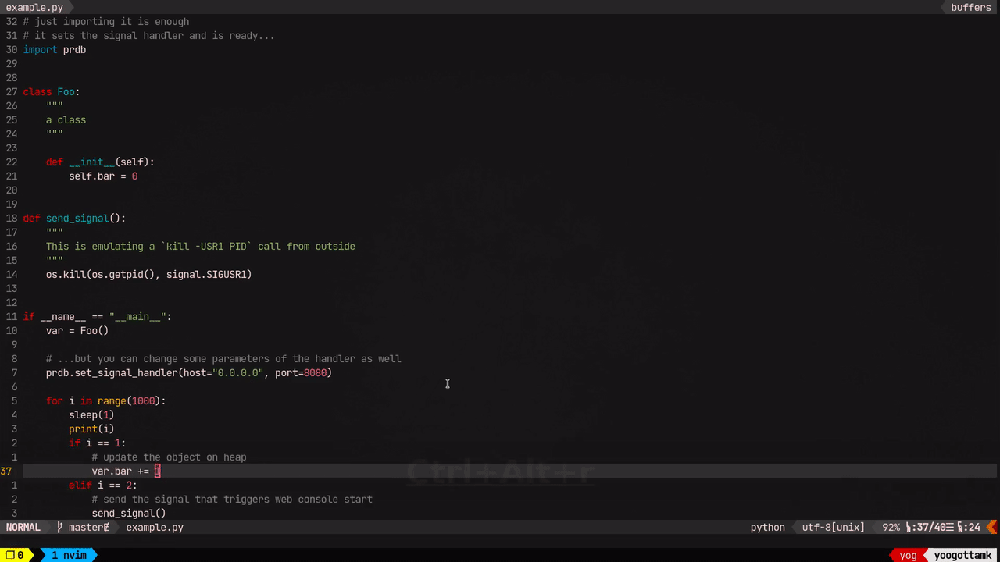
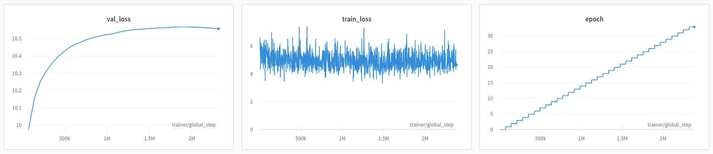

# prdb: python remote debugger\*
(\*) not technically a debugger

Get access to the python console of a fork of a python process, with all globals, over http, simply by importing this module.

## Installation
```
pip install git+https://github.com/yoogottamk/prdb.git
```

## Usage
Simply import it in the script you are going to run.

```python3
import prdb
```

Whenever you want a console, get the PID of the python process and then
```
kill -USR1 PID
```

### Configuration
You can configure the host (defaults to `127.0.0.1`) and the port (defaults to `4242`) on which the http server is started.

```python3
import prdb

...

prdb.set_signal_handler(host="0.0.0.0", port=8080)
```

### Demo


## How does it work?
`prdb` basically installs a signal handler. When the signal is given, it forks the process and starts an interpreter in the child. The parent starts an http server and communicates with the web frontend with `WebSockets` and the interpreter.

### Implications
#### Security
The server is started on `localhost` by default. This means that any user that has access to the machine can get access to the python console. Also, the traffic is not encrypted.

These are probably not "real" issues when running on personal computer. I expect this to be used in conjunction with something like ssh port forwarding if running on a remote machine.

#### forking
Since the console is started in a forked process, the changes that you make in your session don't affect the real process at all. The real process simply stops execution till the session is active and then resumes from where it stopped.

This might be a good thing or a bad thing depending on what you want.

#### `torch` CUDA
Since this needs to fork the process to have the same memory layout, etc., this solution will NOT work with `torch` CUDA. You'll end up getting a `RuntimeError: Cannot re-initialize CUDA in forked subprocess`.

The correct way to have multiple processes with `torch` CUDA is to `spawn` instead of `fork`. [Here's the difference](https://stackoverflow.com/a/66113051). `spawn`-ing wouldn't help this use-case at all.

## But why?
Bad model checkpoint strategy: I decide to create a checkpoint for the best validation loss. Then, this happens:



I had no way to access my model and I lost hours of work. Only if I could get access to an interpreter, I would've been able to create a checkpoint easily.

Some options like [pyringe](https://github.com/google/pyringe), [pyrasite](https://github.com/lmacken/pyrasite/) don't work with python3. The ones that come closest to my use-case are [web-pdb](https://github.com/romanvm/python-web-pdb) and [remote-pdb](https://github.com/ionelmc/python-remote-pdb) [set a signal handler and launch them in the handler]. I wanted to try out something different.

Apart from deciding to be smart about checkpointing from next time (just add `save_last=True`, [link](https://pytorch-lightning.readthedocs.io/en/stable/api/pytorch_lightning.callbacks.model_checkpoint.html#pytorch_lightning.callbacks.model_checkpoint.ModelCheckpoint.params.save_last)), I decided to write `prdb` so I can get myself out of similar situations easily in the future.

## Built with the help of
 - https://github.com/tiangolo/fastapi
 - https://github.com/encode/uvicorn
 - https://github.com/xtermjs/xterm.js

## References
 - https://github.com/cs01/pyxtermjs
